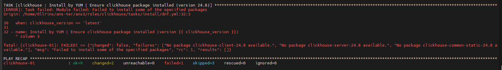

### Домашнее задание к занятию 4 «Работа с roles»

 
[ClickHouse](https://github.com/Ollrins/ClickHouse-role.git "Ссылка на GitHub")
 

 
[Vector](https://github.com/Ollrins/Vector-role.git "Ссылка на GitHub")
 

 
[Lighthouse](https://github.com/Ollrins/Lighthouse-role.git "Ссылка на GitHub")
 
 

Подскажите, пожалуйста, можно ли использовать alexeysetevoi.clickhouse для Rocky Linux 9? У меня не получилось. Буду благодарна за ответ.

  

  
  

  

